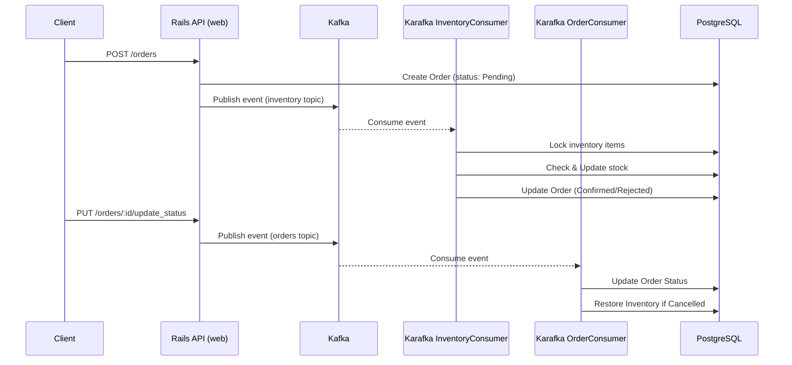

# Order Management System – Flow & Sequence Diagrams

## High-Level Flow Diagram

```mermaid
graph TD
  C[Client] -->|HTTP| W[Web (Rails API)]
  W -->|Create Order| DB[(PostgreSQL)]
  W -->|Publish Event| K[Kafka: inventory topic]
  K --> IC[InventoryConsumer]
  IC -->|Check & Update Stock| DB
  IC -->|Update Order Status| DB

  W -->|Publish Cancel Event| KO[Kafka: orders topic]
  KO --> OC[OrderConsumer]
  OC -->|Update Order| DB
  OC -->|Restore Inventory| DB
```

---

## Sequence Diagram



---

## Text-Based Flow Diagram

```
[Client]
   │
   ▼
[ Rails API (web) ]
   │
   ├── Create Order → [ DB: Order ] ──┐
   │                                  │
   │                                  ▼
   ├──> Publish to Kafka (inventory topic)
   │                                  │
   ▼                                  │
[ Karafka - InventoryConsumer ]       │
   │                                  │
   ├── Read inventory from DB         │
   ├── Lock and deduct or reject      │
   └── Update Order.status            │
                                      │
[Client]
   │
   └── Update Order Status (e.g. Cancel)
        │
        └──> Publish to Kafka (orders topic)
                                          │
                                          ▼
                            [ Karafka - OrderConsumer ]
                                │
                                ├── Update Order.status
                                └── Restore Inventory if needed
```

---

## Descriptive Flow (Step-by-Step)

```
Client → Rails API (/orders): POST with user_id + items
Rails → PostgreSQL: Create Order (status: "Pending")
Rails → Kafka (topic: inventory): publish order_id
Karafka InventoryConsumer → PostgreSQL:
  - Lock inventory rows
  - Check/Update stock
  - Update Order status to "Confirmed" or "Rejected"

Client → Rails API (/orders/:id/cancel or update_status)
Rails → Kafka (topic: orders): publish order_id + new_status
Karafka OrderConsumer → PostgreSQL:
  - Update Order.status
  - If status changed to "Cancelled" from "Confirmed":
      - Restore inventory item quantities
```

Use these diagrams to understand how orders and inventory flow through the system via Kafka topics and consumers.